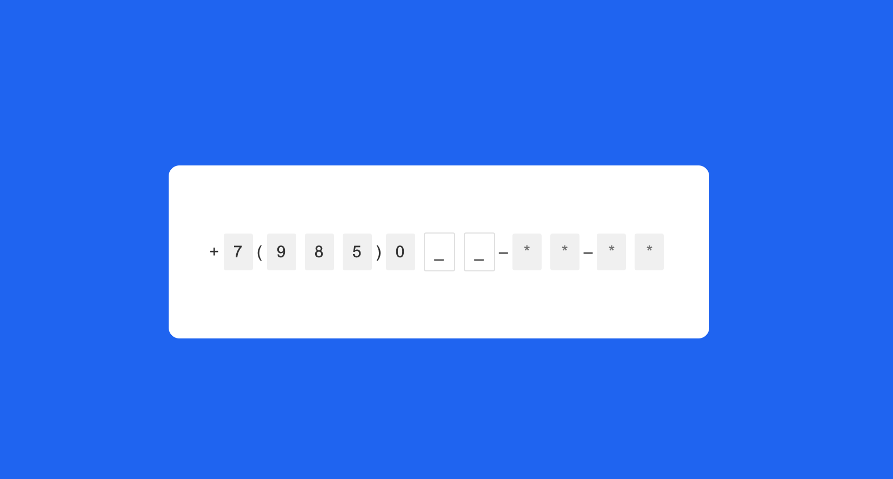
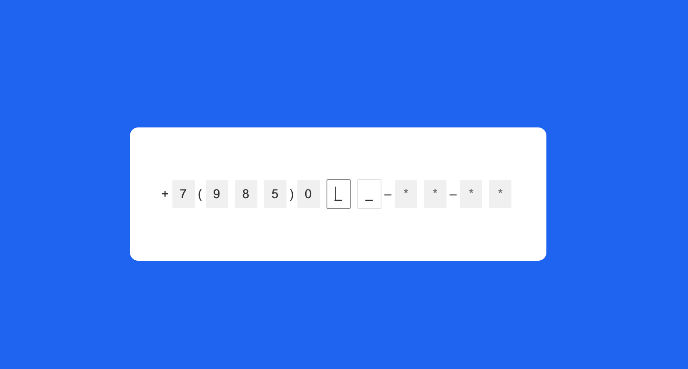
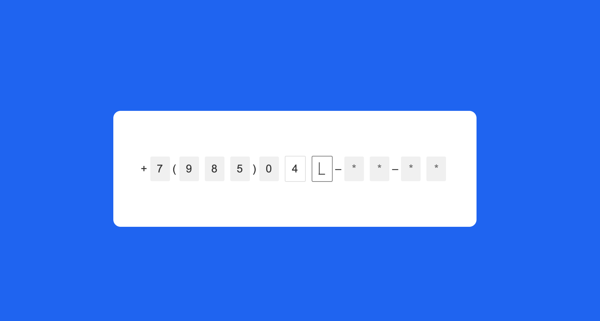
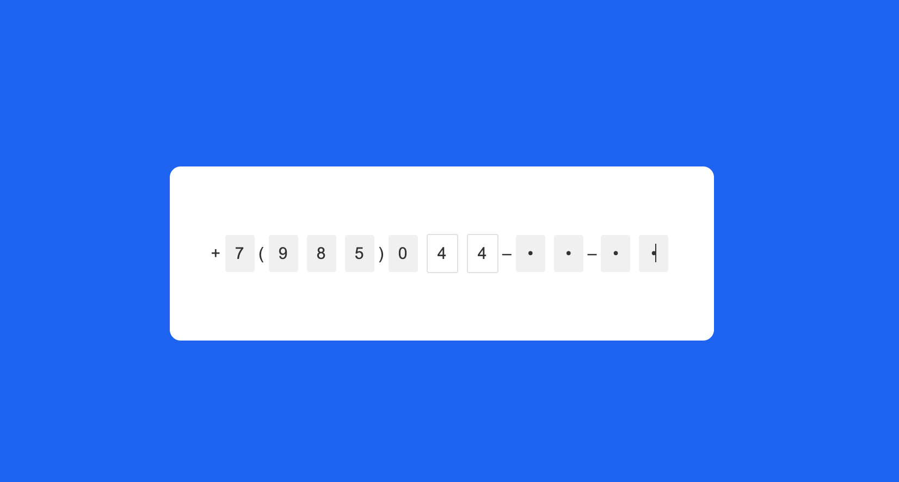
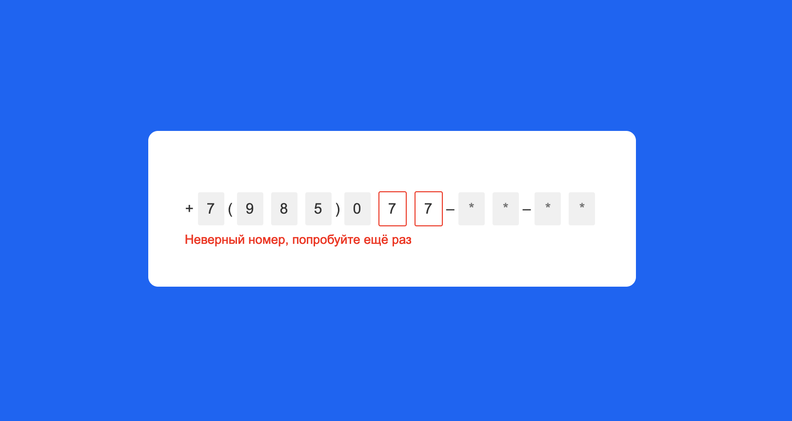

# 📞
Компонент интерфейса для проверки правильности набранного номера телефона.

* соответствие макету — ✔︎
* маска — ⤫

## Установка
1. Скачать репозиторий
1. Открыть в редакторе
1. Копипаст)))

## Скриншоты работы компонента
🍬чтобы сразу можно было посмотреть, как выглядит

### normal

### hover

### active

### correct number

### hidden parts of number

### incorrect number

## Ссылка на Codepen
не сторибук,конечно, но хоть так
https://codepen.io/oxanakochueva/pen/ymNqvW
